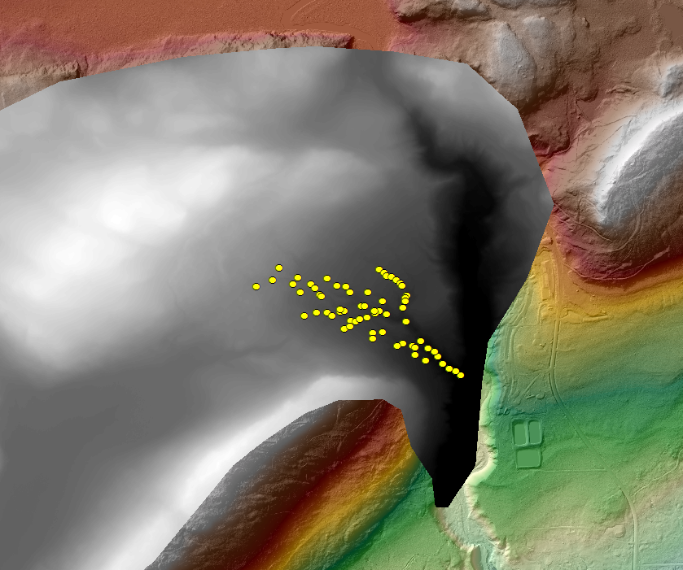
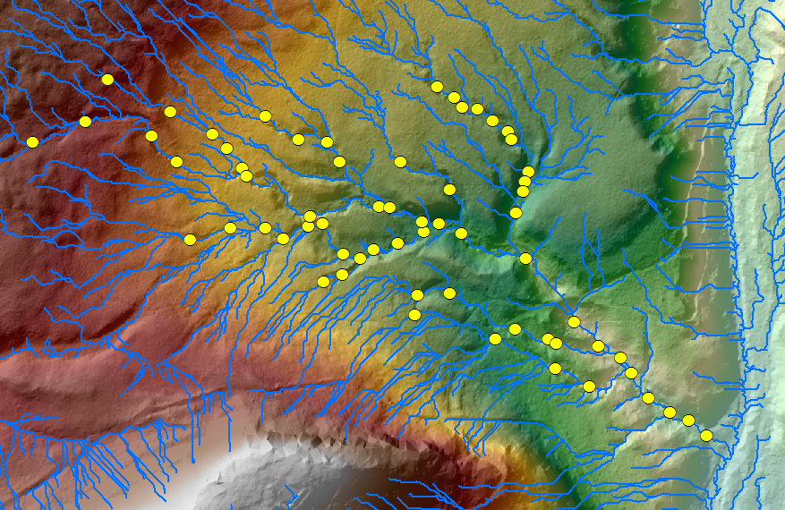
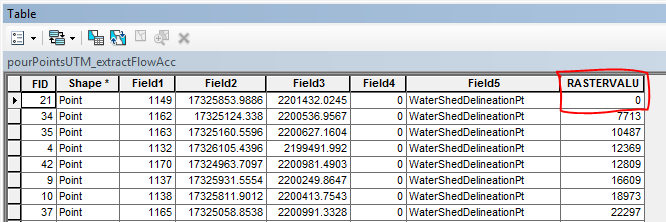
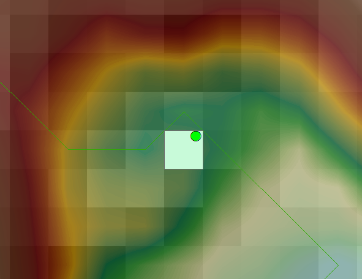
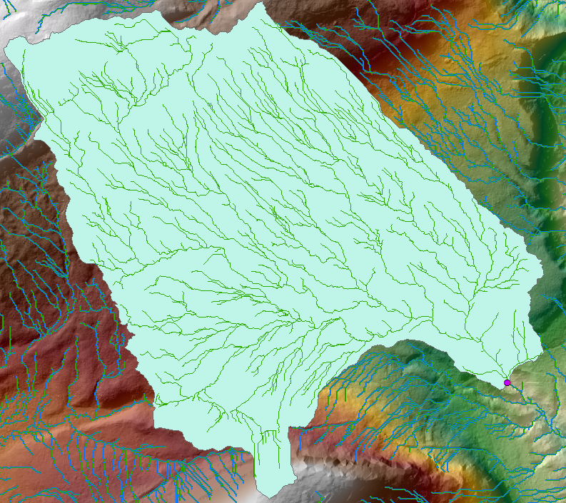

## Watershed Delineation (wsDelineation.py, wsDelineation2.py)
## Synopsis

These script's ([one] (wsDelineation.py), [two] (wsDelineation2.py)) were developed to delineate the watershed boundaries and areas for fifty or so pour points in a similar area.

## Script Inputs

*For the ArcGIS script execution, the following inputs are needed:*
+ Digital Elevation Model (DEM) (1-meter LiDAR in this case)
+ Pour point locations

## Motivation

Instead of manually delineating these watersheds using the ArcGIS Toolbox, or performing batch processes for the watershed delineation (DEM Fill, Flow Direction, Flow Accumulation, Thresholding, Converting Raster to Streamline), these scripts will loop through points and perform these steps for you.  It is necessary to have two scripts as the user will have to verify that the pour point actually falls on a delineated streamline.  If a pour pour does, you will have to manually move the pour point to fall onto a streamline. (See images zeroValue.png and pourPointOffline.png)

## Installation

Download the python scripts above and adjust path names as necessary.  The script was not intended to be a stand-alone tool, but can easily be implemented into an ArcToolbox if need be.

## Tests

This script was developed and tested with ArcGIS 10.2, Python 2.7

Python modules needed: *acrpy, os, time*

## Contributors

Michael Harris is the author of this script.

[StackOverflow] (http://stackoverflow.com/users/4530995/michael-harris)

[LinkedIN] (https://www.linkedin.com/in/michael-harris-366b0060/)

## Acknowledgements

The pour points for the tool's execution came from Tim B.

## License

This code is available under the [MIT License.] (LICENSE)

